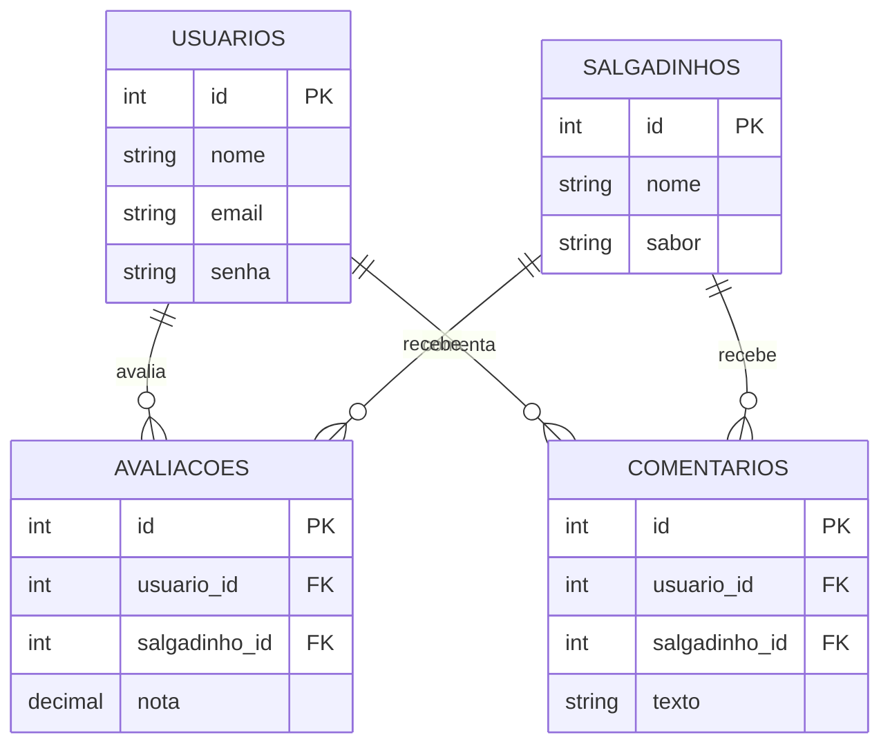

# Salgadinho API 🍟

**Uma API RESTful para gerenciamento de salgadinhos, avaliações e usuários**

## 📌 Visão Geral
API desenvolvida em PHP seguindo padrão MVC para cadastro e avaliação de salgadinhos, com:
- Autenticação básica
- Operações CRUD completas
- Banco de dados SQLite
- Sistema de avaliações (0-10) e comentários

## 🚀 Endpoints

### 1. Salgadinhos

#### `GET /salgadinhos`
Lista todos os salgadinhos cadastrados.

**Resposta:**
```json
[
  {
    "id": 1,
    "nome": "DORITOS",
    "sabor": "QUEIJO NACHO"
  },
  {
    "id": 2,
    "nome": "CHEETOS",
    "sabor": "REQUEIJÃO"
  }
]
```

#### `GET /salgadinhos/{id}`
Busca um salgadinho específico.

**Resposta:**
```json
{
  "id": 1,
  "nome": "DORITOS",
  "sabor": "QUEIJO NACHO",
  "media_avaliacoes": 8.5
}
```

#### `POST /salgadinhos`
Cadastra um novo salgadinho.

**Request:**
```json
{
  "nome": "Novo Salgadinho",
  "sabor": "Frango"
}
```

**Resposta (Sucesso):**
```json
{
  "status": "success",
  "message": "Salgadinho criado com sucesso",
  "data": {
    "id": 11
  }
}
```

### 2. Usuários

#### `POST /usuarios`
Cadastra um novo usuário.

**Request:**
```json
{
  "nome": "João Silva",
  "email": "joao@email.com",
  "senha": "123456"
}
```

**Resposta:**
```json
{
  "status": "success",
  "message": "Usuário criado com sucesso"
}
```

### 3. Avaliações

#### `POST /avaliar`
Registra uma avaliação de usuário para um salgadinho.

**Request:**
```json
{
  "id_usuario": 1,
  "id_salgadinho": 3,
  "nota": 9
}
```

**Resposta (Erro):**
```json
{
  "status": "error",
  "message": "Usuário já avaliou este item"
}
```

#### `GET /avaliacoes`
Lista ranking de salgadinhos por média de avaliações

**Resposta:**
```json
[
  {
    "nome": "DORITOS",
    "sabor": "QUEIJO NACHO",
    "media_nota": 9.5
  },
  {
    "nome": "CHEETOS",
    "sabor": "REQUEIJÃO",
    "media_nota": 8.7
  }
]
```

## 🛠️ Tecnologias Utilizadas
- **Backend**:
  - PHP 7.4+
  - PDO (SQLite)
  - Arquitetura MVC
- **Frontend**:
  - HTML5/CSS3
  - JavaScript (Axios)
- **Ferramentas**:
  - Composer (Autoload)
  - Git

## ⚙️ Configuração

1. **Requisitos**:
   - PHP 7.4+
   - SQLite3
   - Composer

2. **Instalação**:
   ```bash
   git clone https://github.com/LacamJC/salgadinho_api.git
   cd salgadinho_api
   composer install
   ```

3. **Banco de Dados**:
   ```bash
   sqlite3 database/database.db < database/tables.db
   sqlite3 database/database.db < database/inser.db
   ```

4. **Execução**:
   ```bash
   php -S localhost:8000 -t public
   ```

## 📊 Diagrama do Banco de Dados


## 🤝 Contribuição
1. Faça um fork do projeto
2. Crie sua branch (`git checkout -b feature/nova-feature`)
3. Commit suas mudanças (`git commit -m 'Add nova feature'`)
4. Push para a branch (`git push origin feature/nova-feature`)
5. Abra um Pull Request

## 📄 Licença
MIT License © 2023 [LacamJC](https://github.com/LacamJC)